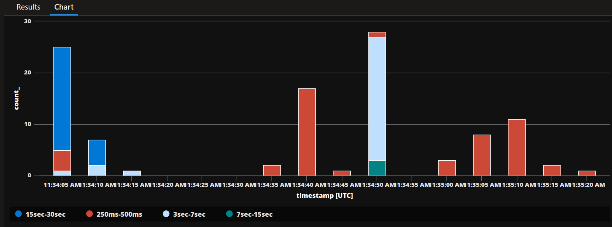
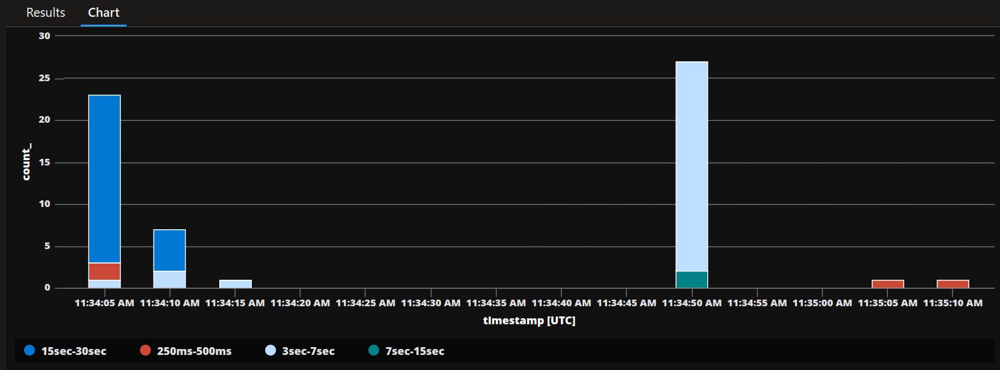

# analyzing >250ms processing time outliers

comparing spread of total single request processing time buckets (how long does it take to process one `q-order-ingress` request)

```
dependencies
| where name startswith "bindings/q-order-ingress"
| where timestamp >= todatetime('2024-01-21T11:34:06.341Z')
| summarize count() by bin(timestamp, 5s), performanceBucket
| where performanceBucket != "<250ms"
| render columnchart
```

with the time it takes to send messages out over Dapr to Service Bus

```
dependencies
| where name startswith "/v1.0/bindings/q-"
| where timestamp >= todatetime('2024-01-21T11:34:06.341Z')
| summarize count() by bin(timestamp, 5s), performanceBucket
| where performanceBucket != "<250ms"
| render columnchart
```

one can see that the spread of bad performance buckets for total ingress



matches the spread of outbound binding latency


